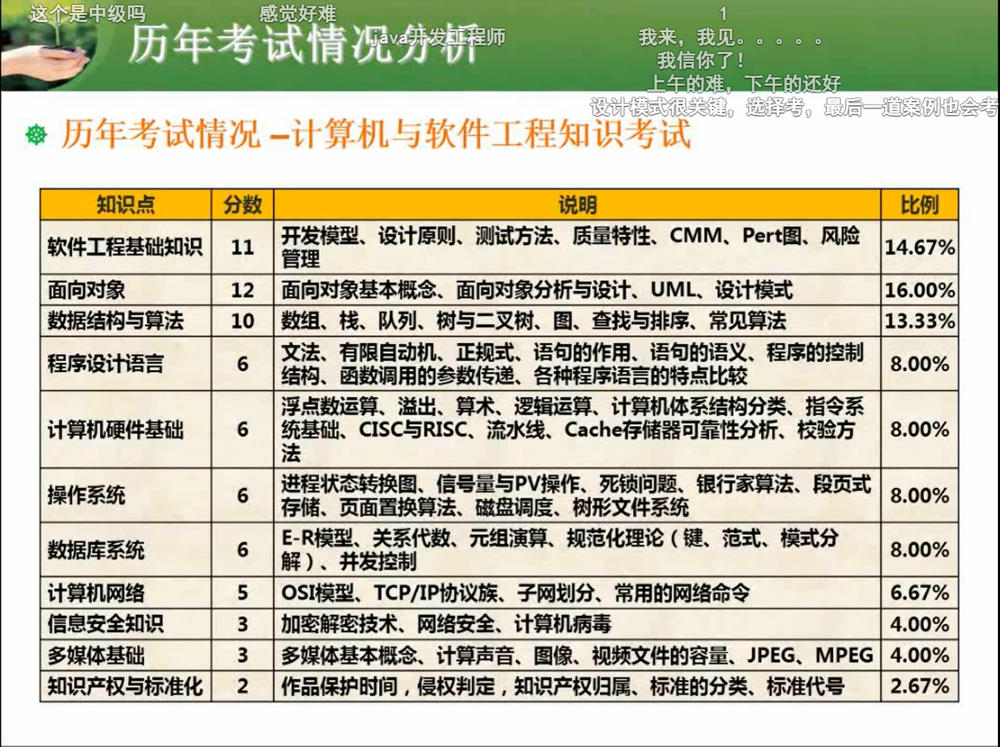
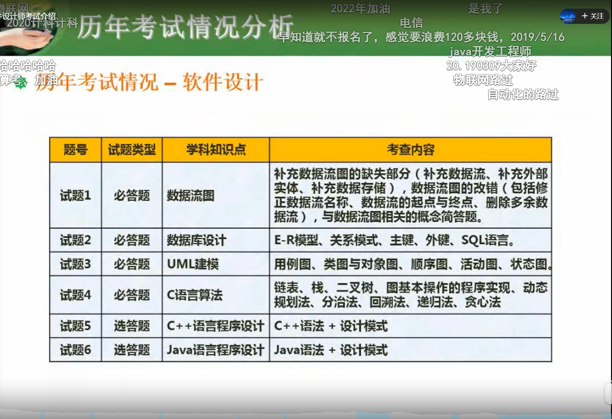
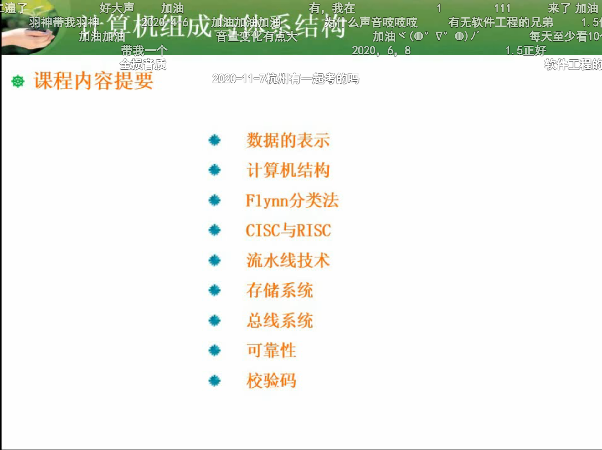
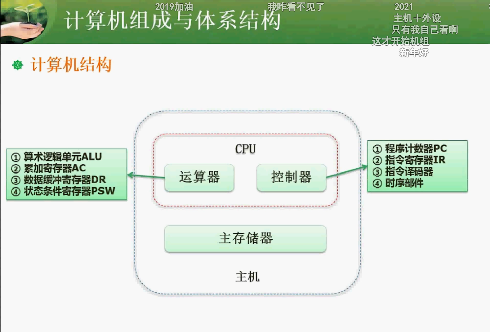
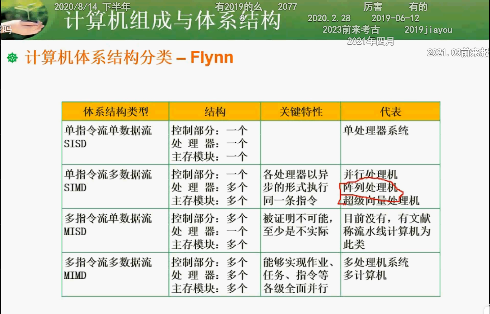
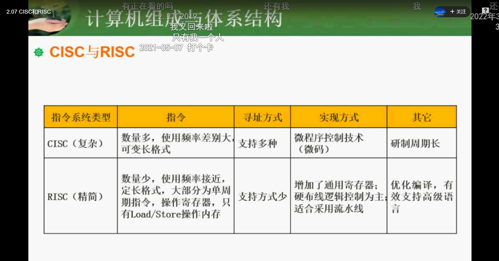

**如果你觉得这份软考笔记对你有所帮助，可以帮我博客账号点点关注，你的支持就是对我最大的动力✨✨**

- **Github**：https://github.com/Benn314

- **CSDN**：https://blog.csdn.net/Bennnnnnn


# 目录

[TOC]


# 软件设计师考点






# 软考第2章目录




# 2.05 CPU结构




# 2.06 Flynn分类法简介




# 2.07 CISC和RISC




# 2.08 流水线的基本概念


# 2.09 流水线周期及流水线执行时间计算


流水线周期：流水线工作中（例如取指、分析、执行）最耗时的部分，就是流水线周期

在考试过程中，80%用到理论公式，理论公式没有正确答案，再用到实际公式


# 2.10 流水线吞吐率计算


# 2.11流水线加速比计算


### 流水线效率计算


# 2.12 计算机层次话存储结构


Cache是极具性价比方案，例如需要for循环执行100万次循环体内容，会从外存调到内存，内存调到Cache不断和CPU交换数据，执行循环体内存，提高速度

CPU内的寄存器速度最快，但容量极小


# 2.13 Cache的基本概念

需要读取数据时，CPU会先访问Cache，如果数据在Cache里面，则称为命中，访问到了，否则则到下一个（内存）中去尝试访问有没有


# 2.14 时间局部性与空间局部性


当访问一个空间的时候，立即又访问了它临近的空间，我们称之为空间局部性原理

被频繁访问的短时间内不被替换成Cache，我们称之为工作集理论


# 2.15 随机存储器与只读存储器


随机存取存储器被称为RAM，内存属于其中一种，掉电会立马清除数据

只读存储器被称为ROM，掉电数据不会被清除


8*4位的存储器中的`8`代表它有8个地址空间，4代表每一个地址空间它存储4个闭合位的信息，比如说`000`它有4个闭合的容量

> 共有多少个地址单元=大的地址-小的地址+1

这里我们可以先加1再去减，计算比较容易

K是1024，要去除以2^10


(1)  (C7FFFH+1-AC000H) / 2^10 = (1C000H) / 2^10 = 112

(2) :


先设置该芯片每个存储单元存储 X 位

（112K * 16）/（28 * 16K * X）= 1，求解X


# 2.16 磁盘工作原理


用磁头读取数据，信息存在磁道扇区上面


R1花费6ms，R1~R10花费（33+3）* 10 ms


布局优化后


# 2.17 计算机总线 


内部总线：微机内部个个外围的芯片与处理器之间的总线，它是芯片这个级别的

系统总线：微机中的个个插电板和系统板之间的总线，它是属于插电板这个层级的，比如PCI的接口，VGA的接口之类的

​		数据总线：用来传输数据的

​		地址总线：假设地址总线是32位，说明它代表的地址空间是2^32次方，也就是4G的宽度大小

​		控制总线：就是发送相应的控制信息的总线

外部总线：微机和外部设备的总线


# 2.18 串联系统与并联系统可靠度计算


R是可靠度，langa和μ是失效度


模冗余系统，输入一些值，通过表决器输出，可以屏蔽输入一些错误的值（因为只是少数），所以结果仍然正确


# 2.19 校验码的概念


要差错和纠错往往是要加冗余信息来实现的，而在编码的过程中往往是通过增大码距的方式来达到我们想要的效果

码距为1，检验不了，纠错不了

码距为2，检验得了，纠错不了

码距为3，检验得了，纠错得了

一般错不会错多位


# 2.20 循环校验码（CRC）


循环检验码，能检错，但不能纠错


现在生成多项式是5位，所以要在被除数后补（5-1）个0，也就是4个0。

为什么补4个0呢？其实就是补余数的位数

循环校验码CRC是用`模2除法`

该题中模2除法后得到了4位的余数，替换掉原先补上的4个0的位置，便得到了CRC密码


验证：

​		再用得到的CRC密码`110010101010011`去与除数`11011`进行模2除，如果得到余数结果为0，那么则答案正确。


# 2.21 海明校验码 


校验位的位置在2^n次方的位置，其他位置再填充信息位

海明校验码能纠错能检错


001代表第一个位置的数值出错了，进行取反即可纠错


# 3.01 操作系统概述

操作原理一般在软考中，考5~7分


操作系统可以说是人与硬件之间的一种接口


操作系统既是人机接口也是应用软件与硬件之间的接口

应用软件与硬件之间的接口是指API的接口，软件要调用一些硬件资源的时候，通过操作系统专为应用软件提供的API接口来实现相关的功能


作业管理和设备管理考的少


# 3.02 进程状态转换图


进程管理：对进程进行管理的时候为进程指定了几种状态，以备于为进程分配相应的资源，把它管理起来

它有三种状态：

​	第一种状态：运行态（它所需要的所有资源都已经配足了，并且给到CPU的资源，这时候便处在运行状态）

​	第二种状态：就绪态（是指它其他所有资源都已经配足了，只缺CPU资源，可以说是万事俱备，只欠东风的状态）

​	第三种状态：等待态（是指除了没有CPU资源，还缺其他资源，比如说和外设有交互，等待用户的一些指令等等）

按时间片来运行，即使任务没完成，也只能退出运行态，进入就绪态，等下一次调度，等下一个时间片轮到的时候才能再次进入运行态


以下为百度百科：

```html
（1）运行(running)态：进程占有处理器正在运行。

（2）就绪(ready)态：进程具备运行条件，等待系统分配处理器以便运行。

（3）等待(wait)态：又称为阻塞(blocked)态或睡眠(sleep)态，指进程不具备运行条件，正在等待某个事件的完成。

通常，一个进程在创建后将处于就绪状态。每个进程在执行过程中，任意时刻当且仅当处于上述三种状态之一。同时，在一个进程执行过程中，它的状态将会发生改变。引起进程状态转换的具体原因如下：

（1）运行态一一等待态：等待使用资源或某事件发生，如等待外设传输;等待人工干预。

（2）等待态一一就绪态：资源得到满足或某事件己经发生，如外设传输结束；人工干预完成。

（3）运行态一一就绪态：运行时间片到，或出现有更高优先权进程。

（4）就绪态一一运行态：CPU空闲时被调度选中一个就绪进程执行。
```


再原三态模型增加了`静止就绪`和 `静止阻塞`两种状态，变成五态模型

运行态时人为干预（手动静止）挂起变成`静止就绪态`


# 3.03 前趋图

前趋图是一个常考点，往往和PV操作结合起来考察，PV操作等后面讲到再详细讲解


前趋图要完成的一系列活动的先后约束关系


# 3.04 进程的同步与互斥

进程的同步与互斥是进行分析一些PV操作的前提


互斥：在同一时刻，我只允许某一个进程去使用这个资源，也就是同一个资源不能同时去服务多个进程

同步与互斥不是互为反义词

互斥的反义词是`共享`，同步的反义词是`异步`


下图为讨论PV操作的经典问题


单缓冲区情况：市场是一个互斥资源，只允许一个人去操作，而生产者放一个资源进去后，无法放第二个，否则将溢出，需要等待消费者						   消费后才能放第二个，与上图的自行车停下来等步行者如出一辙，这便是同步。

多缓冲区的话，可以一次放多个资源，直至市场容量被放满为止

对于PV操作要分析清楚，同步在哪些地方，互斥在哪些地方，才能准确定位哪里要写P操作，哪里要写V操作


# 3.05 PV操作

难度较大（也就那样吧）（用PV操作讨论并发进程，查一下并发进程的概念先）


P(S)、V(S)中的S便是信号量，是应用于PV操作中的专属变量

先看P操作，如果满足了S<0，则阻塞当前进程的状态，把它放到进程队列中进行等待

V操作是P操作的反向操作，V操作的判断条件比P操作的判断条件多了个“=”，注意

V操作如果满足S<=0则从系统的进程队列拿出一个进程来，唤醒它继续去执行，否则的话就继续往底下走了（P分配V释放）


如果没有PV操作的话，会出现以下两种问题，①生产者（产品溢出）、②消费者（缓冲区无产品消费）


s1=0，不满足P操作判断条件，不被堵塞，那么将产品放到缓冲区里去

s2自加1，等于1

第二次，P操作自减1，得到s1=-1，那么进程堵塞，产品不会被送到缓冲区，这样便不会产生溢出问题

那么生产者要怎么才能知道消费者消费完了呢？所以这里我们V操作的判断条件才用到“=”，从进程队列中唤醒生产者，让它把产品继续送到缓冲区

而如果上来直接执行消费者这边的PV操作，也是可以避免错误，s2初值为0，P(s2)后，s2=-1，满足判断条件，进程被堵塞，也就是消费不了产品，避免了错误发生


# 3.06 PV操作练习题1


a1和b1需是配对状态（同一个S变量，是s1还是s2无所谓，一个变量名而已），收银员无法直接收银，所以b1唤醒a1进行付款，而a1不是付完款就可以直接走，要等待收银员b2进行找零钱，然后唤醒a2完成收款零钱操作，最后完成一人操作，P(Sn)和V(Sn)则是表示“该书店最多允许n个购书者进入”

需要购书者和收银员二者才能完成收款操作，所以这里面有着同步操作（PV操作）

V操作可以看成是动作请求发出，在该题中a1便是提出付款申请，等待b1的收款（唤醒操作）

然后在购书者这边，也会有进程堵塞的情况`P(S)`，a2等待收银员完成收银找零


# 3.07 PV操作与前趋图


要把一个前趋图转成PV操作的形式，实际上就是把前趋图的每一个活动形式转成相应的进程，然后为了让这些进程在并发执行的时候依然按前趋图的前后关系顺序去执行，所以加入了相应的PV操作（这种类型的题经常考，所以要求一定要掌握）


这种题呢，按从左到右，从上到下先设置好进程对应的信号量，发出为V(S)，接收为P(S)，标注完成再去对比选项，就不会乱


# 3.09 死锁问题


对上图来讲，如果系统有13个资源则不会发生死锁，假设每个进程都占有4个资源，系统再多一个资源则可完成一个进程任务，接着再去完成下一个，以此类推直至全部完成

所以求死锁问题的思路就是先给每个进程分配（它所需要最大资源 - 1）资源，然后系统再多一个资源就不会产生死锁

公式可以概述成：k*(n-1)+1   k为进程数量，n为进程最大资源数


# 3.10 银行家算法

考察频度较高


互斥、保持和等待、不剥夺、环路等待，占一个即可能产生死锁


剩下（可分配）的资源数=可有资源数 - 已分配资源数

然后再去看一下各个进程`还需资源数`，剩下资源数能不能满足，满足即可分配，完成该进程任务，然后获取它的进程资源数到`剩下资源数`


# 3.11 分区存储组织


分配前为什么这里作业1和作业2会间隔一个25k大小的内存呢？

可能是出现了这种情况，25k内存这里在作业2之前有任务执行，占用了25k，任务完成后释放掉内存，便看到如图的空白25k内存

用最佳适应算法有一个缺陷，就是系统运行一段时间后，系统资源的碎块很多，而且这些碎块很不好利用，因为碎块太小，都是几k几k的


讲一下循环首次适应算法，就是将内存自上而下连接起来，形成一个环状（如上图），从25k内存分配一次内存后从28k内存分配再到10k内存分配最后回到25k内存重新分配，这样的好处是内存块的分配比较均匀，不会只盯着一个内存块进行分配


# 3.12 页式存储、段式存储、段页式存储


该部分知识最重要的是掌握页式存储中的逻辑地址和物理地址之间的转换

为什么要提出页式存储的方式呢？之前提到了分区域化的管理，就是我们会在内存当中划定一个用户区域，然后这个区域是供用户程序调用内存的时候使用的，在这种管理方式当中是把用户程序整体的调入到内存当中，这也就意味着你的内存是4G大的，用户空间2个G，如果这时要运行2G以上的程序是运行不了的，甚至1G可能都够呛，因为在内存当中运行的时候它可能被打碎了，它不是连续的1个G的空间，虽然空闲内存加起来有1个G大，但不能运行1个G的程序，因为它无法一次性的装入

先把用户程序分成等分大小的页，比如这里把用户程序分成等分4k一个块的区域，每一个4k的块称为一个页，把内存当中的存储区也分成4k一个，然后我要调入程序来内存运行的时候，不再是把整个的用户程序一次性的调用，采取的机制是要运行哪些块我就把哪些块调入进来，这样一来就需要一个页表来记录它们之间的映射关系，就是用户程序当中的多少页对应内存当中的多少号块

页式存储：要调入程序到内存来运行的时候，不再是把整个的用户程序一次性的调用，采取的机制是要运行哪些块我就把哪些块调入进来

这样一来2G的内存都有可能运行4G的程序

这样的好处是内存的利用率高

连续的空间就不用就映射表便可以调到相应的内存块，而采用页式存储，我们需要先读取页表再去到内存，增加了时间和系统开销


如何通过逻辑地址寻找物理地址？

逻辑地址的页内地址即是物理地址，直接写下来，然后再查找页号的物理地址（通过页号去找块号，即是物理地址），把这两段物理地址拼接起来即是逻辑地址的物理地址，页号有可能不一样，但页内地址都是一样的


从题干可知，页面大小为4k，即2^12次方，则页内地址是12位，那么高于12位的部分就是页号


物理块号有多种叫法，我们也称它为页帧号

状态位为0，代表不在内存

而页面的淘汰只能淘汰在内存里面的，内存外淘汰不了，看状态号为1的，从页号为0、1、2、5找一个淘汰，找哪个看访问位了

访问位为1的不能淘汰，只有访问位为0的才可以淘汰，所以该题中应淘汰页号1


段式是按逻辑结构来划分的，段长可以不一样


快表（联想存储器）是放在Cache，慢表是放在内存上的


# 3.13 页面淘汰算法


页面置换算法广泛应用于分层的存储体系当中

考试当中有考到的话，先进先出（FIFO）算法和最近最少使用（LRU）算法会多一点

最优算法（OPT）是理论层面上的算法，它是程序运行完后知道整个要访问的页面的序列是怎么样的，然后分析什么时间点淘汰什么页面，能够取得最高效率性能（而我们是要运用于进行时的）

先进先出算法的基本思路：我要淘汰页面的时候，看内存里面这3个页面或者4个页面，哪个页面是最新最先进入到内存的，那我就先淘汰谁

抖动：为了能让进程更出色的完成任务，分配了更多的资源，但反而没能比正常运行完成的好，而在页面置换算法中则是假如分配3个页面，淘汰率是10个缺页，而分配4个页面，淘汰率只有11个缺页，这显然不是我们想看到的，效率降低了

最近最少使用算法：分配资源越多，表现性能越稳定，根据你的使用情况来看，刚刚被访问过的是不会被淘汰出去的，因为局部性原理，刚刚被访问到的页面可能很快再次被访问到


横为要访问的页面序列，列为内存的三个页面

缺页表示为内存页面内没有该序列，接着把序列号填写到内存里面去

而页面为4页的时候，缺页为10次，只多了一次，所以出现了“抖动”现象


来到序列3时，内存页面没有该序列号，产生缺页中断


# 3.14 页面淘汰算法练习题


没有使用快表说明每读取一次程序的块，需要先在内存上面来查一下表才能读取相应的内存块，所以每一个块需要进行两次内存的访问，图中总共是6个块，所以会产生12次访问

而按常规跨了两个页，应该是按两次读入的，而指令不会，swap指令存在1023单元，页面大小为1k（也即1024），所以会跨页，不过指令还是一次性读入，只产生一次缺页中断

而数据类型的A（操作数），在2号和3号页各有一段，就会产生2次缺页中断（数据不同于指令，这点注意一下）


# 3.15 索引文件结构


索引文件结构引入了一种扩展机制，可以很方便的把文件容量扩大很多倍	一般索引结构是有13个结点


访问的盘块多了，不过访问效率也低了，间接了太多次

指向物理盘块的都是它的地址，上图假设的是一个地址占4字节，那么可以存（4k/4）= 1024个地址


习题


逻辑块号通常都是从0开始算起


逻辑块号261对应的物理块号是187的原因：

题干说明磁盘索引块和磁盘数据块大小均为1KB字节，每个地址项大小为4字节，所以一个索引块可分为（1K/4=256个索引地址）

先看90号索引，第一个逻辑块号对应的是5号，5+256-1=260，也就是最后一个逻辑块号为260，所以261在下一个直接地址索引的一级索引对应的块号，也就是物理块号为187对应的那个。


# 3.16 树形目录结构

主要考察绝对路径和相对路径的概念


跟打电话加国号和区号一个道理


# 3.17 位示图法


空闲区表法：我们可以用一个表来记录哪些地方是空闲的，以便把它管理起来

空闲链表法：是把空闲区都链起来，然后要进行空间分配的时候，从链表上边划出相应的空间来用就行

成组链接法：是分组也分链的方式

主要还是了解`位示图法`

位示图法：表中标记为1的区域表示已经被占用，而标记为0的区域表示未被占用（空闲）


4195号在第4196号物理块上（序号从0开始），（4195+1）/ 132 = 131.125 ， 所以应该在第132个字中描述


图中求的是4195，即在第3位置，所以将该字的第3位置 “1”

还有就是多少位置，都是从第0位开始算的


# 3.18 数据传输控制方式


主要指的是内存和外设的数据传输问题

通道和输入输出处理机都是专用的计算机来解决

程序控制方式又称程序查询方式，这种是最低级的，也是CPU介入最多的一种机制，这种方式外设处于一种很被动的方式，就是它不会主动的去反馈信息，传输完成没有会主动去反馈，由CPU发出查询指令

程序中断方式，主动性相比程序控制方式强一些，程序完成时会发一个中断出来，让系统做下一步的处理，比查询方式好些

DMA方式：直接存取控制方式，会有专门的DMA控制器，主要是外设和内存之间的数据交换，过程之中就由这个控制器去管控，CPU只要在开头的时候做一些介入，比如安排好一些事务，做好一些初始化之类的，整个过程有DMA控制器监管，完成之后由CPU过来做后续工作，这样子效率会高很多


# 3.19 虚设备与Spooling技术


Spooling技术就是把需要打印的东西先缓存起来，把前面的任务完成后，便会自动进行完成缓冲区里的任务

然后在软件应用中它会显示任务队列，前方任务进展和你的任务

所以虚设备和Spooling技术往往是在磁盘上开盘区来解决速度之间的矛盾与差异


# 3.20 微内核操作系统


顾名思义就是把内核做得更小的操作系统

为什么要做更小？主要体现在它的 `可靠性、稳定性、安全性` 上

把内核做小，只保留最核心的部件，其他都放在核外，便会大大降低故障率

比如之间用XP系统，经常蓝屏之类的就是内核出现了问题


# 4.01 数据库系统前言


规范化理论是上午题都会出现到的知识点


# 4.02 数据库三级模式两级映射

一般以选择题的题目出现


物理数据库在操作系统体现成一个文件

内模式管的是我们如何去存储这个数据，我们要把数据存储到文件上面，那么要以什么格式来存储，如何去优化它

内模式关心数据的存放这一块

概念模式体现的就是我们平常用数据库时，表的这么一个级别

再到上层，外模式，它所对应的是数据库中的视图，外模式的应用让我们对数据库的应用有了更进一步的手段，更加灵活的处置方式同时也更安全

有了外模式-概念模式映射，表发生了变化，我们只需要改映射，而不需要改应用程序

概念模式-内模式映射，主要管内部的存储形式和表的情况的一种映射关系，意思就是存储结构发生了改变，我们只需要调整映射关系，而不需要去修改用户的应用程序就能够应对这种变化

内模式有时会叫它物理级数据库

概念模式有时会叫它概念级数据库

用户的应用程序这个层次是用户级的数据库


# 4.03 数据库设计过程说明


# 4.04 ER模型


逐步集成，优点简单、不容易出错；缺点：耗时


1对多的关系，把关系合并到实体的话，合并到多的一边，举例：员工与部门，部门人数有多有少，少则几人，多则几百人，放部门表太难去收集了，而放在员工表的话，只需加一个部门的属性就好了

多对多的关系如图


学生要转成一个实体表，课程要转成一个实体表，它们的关系选课也要抽象成一个实体表

对多对多的模型至少要转成3个实体形式


习题


题干说明ER图为多对多关系，至少（3+1）个 = 4个

从题也可以说明，即使产生关系的实体大于2个，也不用抽象成多个实体关系表，一个也可以，所以看关系块数就好了


# 4.05 关系代数


主要考察后面4个，特别注意笛卡尔积和联接之间的差异，因为找等价形式没别的好找的


笛卡尔积的结果集的属性的个数是参与操作的两个关系的属性数之和（如上图，3+3=6，属性）

而记录数是两个记录之积，比如S1有三条记录，S2也有三条记录，这样笛卡尔积的结果有9条记录


Π1，2(S1)表示对属性列的第一列和第二列做投影

投影和选择其实有点像select查询


6是选择的意思

除了表中的写法，红字的61=No0003也是选择第一列中No0003的意思


S1和S2之间的符号是联接符，联接符下面要写联接条件，比如S1.Sno = S2.Sno

等值连接相同字段只会保留一个字段，而笛卡尔积有相同字段是把它们拼接起来

没有写联接条件被称为自然连接，自然连接就是两个表相同的字段做等值连接（看图是数据是交集的结果，而属性是拼接了起来）


注意等值和笛卡尔积投影的列数值是有差异的


# 4.06 规范化理论_函数依赖


上图中的图二，如果B能反过来确定A，那么说明A和B是等价关系，不存在传递性


# 4.07 规范化理论的价值与用途


插入异常，举个例子，两个属性的关键字的组合作为关键字作为主键，如果说两个属性当中的一个还没有明确的时候，是没有办法插入数据的，这就是插入异常

删除异常，如果发现删除数据的时候同时删掉了不该删除的，这也是删除异常


# 4.08 规范化理论_求候选关键字


超键可能出现冗余属性，而候选键不存在冗余属性，二者均可唯一标识元组


学号是超键和候选键，（学号，姓名）是超键，因为单一个学号可以确定性别，（学号，姓名）也可以确定性别，所以姓名是冗余的

候选键可以有多个，而主键只能是一个

外键提出来，主要就是为了关联查询的时候用到它


用图示法求候选键，先找入度为0键，从它出发，能够遍历整个图，那么它就是候选键，例1答案为A1


如果没有入度为0的关键字，那么就找有入度也有出度的关键字，例三的A和B都有出入度同时它们都能遍历整个图，所以答案为A和B


# 4.09 规范化理论_范式


达到第一范式便是细分原子值，高级职称人数细分为教授和副教授


SNO、CNO的组合键才能确定GRADE这叫完全依赖，而CREDIT可由CNO直接确定，这叫部分依赖

主码不全会导致插入异常，例如新增了一门课程，还没有学生选，想插入上图表中是行不通的，因为没有对应的SNO

删除异常，学生毕业了想清除数据，把CREDIT（学分）也给清除了，这叫删除异常

解决以上方法：把CNO和CREDIT提取出来做一张新表，原表中的CNO不能删除（主码不全，确定不了GRADE），CREDIT可以删除

单属性不存在部分函数依赖


主键是单属性便是第二范式


没有非主属性，全都是第三范式，这里的SJ和ST都是候选码，，且它们已经包含了整个图的元素了


确定是否为BC范式，函数左边全为候选键，右边是依赖键

如上图，SJ->T（可以，左边是候选键），T->J（不行，左边不是候选键），这里的SJ和ST是候选键，所以上图不是BC范式，有部分不成立


# 4.10 规范化理论_范式练习题


不属于第三范式的原因有二：

- ①没达到第三范式的要求

- ②连第二范式的要求都没达到


# 4.11 规范化理论_模式分解


保持函数依赖分解如上图红字

冗余的不需要保存


表格法


上图这种方法一分为二会特别高效


第一种方法，先求交集再求两者的差集

此时，如果有A确定B，就是无损分解，所以第一题是无损分解，第二题是有损分解

所以一分为二可以用这种方式求解


# 4.12 数据库并发控制


事务，要保持完整性，要么全做，要么全不做，例如银行转账，转出方和转入放要绝对完整独立，不然可能导致转账失败


丢失更新：T1读取10，然后自减5，T2读取10，然后自减8，结果是A=2，而不是一次性减去了13，A=2覆盖了A=5

不可重复读：计算后想验算本来是为了提高可靠性，但由于T2对数据A做了更新，A的值已经不是原来A的值了

ROLLBACK是回滚，之间的计算不作数，回退到最原始没计算T1前的值，那么这里“70”是一个藏数据，也是临时值


# 4.13 数据库完整性约束


实体完整性约束，约束主键，主键的值不能为空

参照完整性约束，约束外键，约束后不能乱填，乱填系统会给报错提示，填的应该是系统里面对应主键的内容

用户自定义完整性约束，比如年龄就应该设置一定范围且不能是负数

以上三种完整性约束只能应对简单的情况，复杂情况不容易应对

触发器可以写脚本来约束数据库数据的一些要求，所以更多复杂的情况往往用触发器机制来完成的


# 4.14 数据库安全


# 4.15 数据库备份与恢复


热备份不允许出错，否则业务恢复会很麻烦


增量备份内容小，但要恢复备份麻烦，以上图为例，要恢复周三的增量备份，首先要一次往前恢复到周日的完全备份，然后回退恢复到周三

差量备份的话，出故障要恢复备份直接恢复周日的完全备份然后直接恢复周四的差量备份就ok了

转储就是做备份

查询不是在日志文件考虑的范围内，增删改是

先写日志，哪个数据怎么进行操作，再来写数据文件，这样子做一当写数据文件出故障了或者以后出故障了，咱们要恢复到这一个状态的时候，可以把日志找出来看之间日志文件做了什么操作，重新做这种操作，相当于恢复到了故障时间点了，这是日志文件的基本思路情况


# 4.16 数据仓库与数据挖掘


广泛应用于一项技术，BI商业智能，BI的核心技术就是数据仓库与数据挖掘

数据库与数据仓库是不一样的，后者一般是历史不再应用的数据主要用于大规模数据的查询与分析，比如超市的收银记录，收银记录对收银员和机器没啥用，但对企业家的决策分析和对未来的走向判断与用户的喜好分析有着很大的作用

上图中的清理是做数据格式的统一，去除冗余数据之类的事情

数据集市，部门级的数据仓库，直接建一整个风险会很高，分期一步一步来建数据集市可以减低风险，建好后把它们整合成企业级的数据仓库就好了

OLAP服务器就是连接分析处理服务器，它是专门做分析处理工作的，最表层是数据的前端工具，上图展现的4个工具就是前端工具

数据挖掘工具比较独特，可以挖到人类所未知的一些事物，所不知道的一些特性


# 4.17 反规范化技术


# 4.18 大数据基本概念


# 5.01 七层模型


一、物理层

传输距离过远，涉及到信号的衰减，衰减到一定程度就传不过去了，比如网线一般就有100米的这种限制，而现在我们要传200米怎么办呢，就在中间加一个中继器，这个中继器接收一边的信号再原封不动地从另一端发出去，有延长传输距离的作用，中继器不会考虑数据的情况，只会原封不动的照搬，类似古代的烽火台

集线器又被称为多端口的中继器，也是简单的接收信息便传出去了	

二、数据链路层

网桥是用于连接同类型网络的设备

交换机也称为多端口网桥，用来连接多个设备，联网起来，在这个层次信息传输已经有地址了，所以交换机比集线器性能要高很多

三、网络层

路由选择很重要，做最佳网络路径选择

四、传输层

传输层涉及到端到端的连接，也就是端口号的问题，主要有两大协议，TCP和UDP


考察局域网和广域网的差异问题

局域网是工作在下面两层的（七层模型），局域网的典型设备的交换机，局域网内部有广播，发送广播消息，整个局域网内部的成员都能收到消息，但是出了这个局域网他们就收不到这个消息，所以这个题就是考察分析看哪些地方的网络属于同一个局域网之内的，哪些属于不同的局域网

不能够通过的，往往是跨越了网络层就不能通过了，跨越了网络层就不是同一个局域网


# 5.02 网络技术标准与协议


ICMP：因特网的控制协议，像我们平时用到的`ping`命令就是ICMP协议里的

ARP和RAMP，一个是地址解析协议，一个是反向地址解析协议，他们分别是IP地址转MAC地址、MAC地址转IP地址

TCP是可靠协议，UDP是不可靠的协议

TCP在通信的时候会建立连接，而UDP不建立连接

TCP协议为什么可靠？因为它有验证机制，传输时有反馈信息，那么我们就可以及时的知道哪些数据包正常地顺利地传到了目的地，而哪些没有，而且TCP在进行通信前还会进行三次握手的活动


而UDP则没有这个验证的过程反馈的过程

所以在TCP上的那些协议也是可靠协议

像HTTP是用来传输网页数据的，FTP是文件传输协议、Telnet是做远程登录的，POP3和SMTP是做邮件传输的

下面看一下基于UDP协议的

最典型的DHCP协议：在局域网里很常见，通常都会有DHCP服务器，用来做动态的IP地址分配工作

THTP协议：小文件传输协议

SNMP协议：属于简单网络管理协议

DNS协议：做域名解析的


来看两个特殊的IP地址

如果你分配到的地址是169.254.X.X（在windows体系里）或者0.0.0.0（Linux体系里 ），说明可能你没有和DHCP服务器连接上，所以呢导致你分配IP地址没有成功，这两个段的地址是假地址，它们不能跟外界通信，说明你没有得到新的地址，所以这时有可能是局域网DHCP的服务器出故障了，也有可能是你这边计算机的原因没有跟它联系上


下面看一下DNS服务器的情况


真正用来识别计算机的是IP地址

DNS，域名和IP地址之间的转换

这里考的比较深的是DNS体系当中的迭代查询和递归查询，因为在DNS体系当中有两种基本的查询方式也是查询域名，递归和迭代、

迭代，就是我问你你不知道，就把这个包丢给别人了（提供线索）


用递归的话是回返回结果的，上图可以说明根域名服务器没有做事，故为迭代查询，不然它跟中介域名服务器间应该要建立联系


中间的Samba、CIFS、NFS则是即可以用TCP协议实现也可以用UDP协议实现

Samba、CIFS、NFS都是文件的共享协议，其中Samba比较有特色，可以跨平台


# 5.03 网络类型与拓扑结构


世界范围：因特网

星型结构容易出现单点故障的问题（中心点），环型可靠性比星型好一点

办公室办公采用星型拓扑结构，中心点是交换机，然后连成局域网


本词条由[“科普中国”科学百科词条编写与应用工作项目](https://baike.baidu.com/science) 审核 。

[网络拓扑结构](https://baike.baidu.com/item/网络拓扑结构/4136060)就是指用传输媒体把计算机等各种设备互相连接起来的物理布局，是指互连过程中构成的几何形状，它能表示出[网络服务器](https://baike.baidu.com/item/网络服务器/99096)、工作站的网络配置和互相之间的连接。网络拓扑结构可按形状分类，分别有：星型、环型、总线型、树型、总线/星型和网状型拓扑结构。 [1] 

星型拓扑结构将各个节点与中心节点连接，呈现出放射状排列，通过中心节点对全网的[通信](https://baike.baidu.com/item/通信/300982)进行控制。总线型[计算机网络拓扑结构](https://baike.baidu.com/item/计算机网络拓扑结构/10230127)主要是通过一条高速主干电缆对周围节点进行连接。环型计算机网络拓扑结构可以对节点收尾的信息进行循环，形成闭合的环型线路，提高单项传输的完整性。树型计算机网络拓扑结构可以保证两节点之间的无回路传输，保证计算机网络拓扑结构扩充的方便性。网状型计算机网络拓扑结构将节点之间的线路进行网状连接，有效提高了线路之间信息传递的可靠性。 [2] 

- 中文名

  拓扑结构

- 外文名

  Network Topology

- 相关学科

  计算机网络

- 具  体

  由点和线组成的几何图形

- 分  类

  总线型拓扑、星形拓扑

- 概  念

  网络中各个站点相互连接的形式


# 5.04 网络规划与设计


画线为偏重点


分层设计考得比较多

接入层和核心层都只有一个层次，汇聚层可以有多个

核心层：高速数据的交换和转发，一般都有冗余设计，两台设备做一样的事情，一台坏了也不打紧

考虑一般是自下而上考虑设计，从需求出发，看核心层应该达到一个什么样的指标


# 5.05 IP地址与子网划分


上图是IPV4地址的划分，常用的是前三类，后两类用途特殊


**A类地址**

一个A类地址网络，他所包含的主机数量是`2^24-2`台，在一个网络当中，主机号为全0是网络地址，全1为广播地址

前8位是网络号，后面24个闭合位都是主机号

为了扩展其他类的IP地址，规定A类地址首位为`0`，这里面还包含保留地址


**B类地址**

B类地址规定前两段为网络号，后两段是主机号，那B类网络所容纳的主机数是`2^16-2`台


**C类地址**

C类地址前三段是网络号，最后一段为主机号，那C类网络所容纳的主机数是`2^8-2=254`台


第二阶段发展来源：C类网络不够用，B类网络太多造成浪费，所以为了更适应实际情况，划分子网解决该问题

第三阶段也成为无类域间路由，发展来源：为了让小网络组成大网络


IP地址/XX ，说明该地址的前XX位是==网络位==，主机号是（32-XX），数量是 2^(32-XX) - 2 台

经常考到的问题：给你一个场景，让你来做网络的划分或者说做超网，所谓做超网就是把多个网络给它汇聚起来，形成一个更大的网络

所谓子网划分就是把一个网络分成多个网络，我们看这是依据什么样的东西来完成？


把一个网络合并或者拆分，都需要用到子网掩码，通过设置不同的子网验码就是进行不同的网络划分和网络的汇聚

子网验码本来就是用来区分一个IP地址哪些部分是网络号哪些部分是主机号

子网掩码当中为`1`的部分对应的是网络号，为`0`的部分对应的是主机号，当然这个为1为0都是把子网掩码划成二进制的情况


2^k = N  取k个闭合位会得到N个子网（但这种说法也不太正确，以前的子网号数是2^k -2=N）

上图该题主机号部分取5个闭合位（1111 1）做子网号就OK了

那么该题子网掩码是这么写的，前面网络号的呢，全1，后面主机号前5个闭合位为1后面全为0


|        | IP地址                                  | 子网掩码                                |
| ------ | --------------------------------------- | --------------------------------------- |
| 十进制 | 168.195.0.0                             |                                         |
| 二进制 | 1010 1000 1100 0011 0000 0000 0000 0000 | 1111 1111 1111 1111 1111 1000 0000 0000 |


有的时候题目会问我们两个网络或者说两个IP地址他属不属于同一个子网之内，那这个时候我们要怎么判断呢？

把这两个IP地址化成2进制，分析网络号和子网号分别是多少位，看前面的这么多位是否相同，相同的话说明它们在同一子网之内的


解释一下为什么是答案是16

C类子网有8个主机号，而上图中地址的划分是有12个主机号，(2^12) / (2^8) = 2^4 = 16个


# 5.06 特殊含义IP地址

选择题出现


最后两个，是假地址，IP本身不合法，无法正常上网，原因是你没有获得正确的地址且无休止向系统发送网络地址请求，搪塞你的假地址

第5-8个，局域网内部地址，不是公网IP

127网段 回播地址需要自己上网查一下详细


# 5.07 HTML


HTML是一种标签语言


# 5.08 无线网


个人网最小，局域网次之


# 5.09 网络接入技术


3G/4G也是属于无线接入

有线接入主要是掌握ADSL

PSTN最为原始的拨号形式（pos机、传真）

DDN数字专用网，专线

ISDN，又称为一线通，有了它后，允许在打电话时上网，而不会断网，而且速率比以前快了一倍，可以达到128Kb/s，但还是很慢，所以不久后便被ADSL取代了

ADSL用的电话线进行通信，广泛应用家庭，因为用电话线就不用去布新的线路,相对来讲成本要低一些

非对称将的就是上下行不对称，ADSL上行到512Kb/s，下行到20M/s

而光纤是对称的

HFC，主干揽是光纤，然后入户是同轴电缆，家里有线电视就是这种

红外IrDA也可以传输数据，有了蓝牙普及后，红外优势便不再明显，因为它的传输速率低

TD-SCDMA是名义上的国产，为什么将名义上的呢？因为里面90%以上的专利还是国外的，但是它是由中国主推出来的，但标准不这么成熟，速率比较低而且功耗比较大，缺陷比较明显，它的运营商是中国移动

CDMA2000的运营范围也很小，是中国电信在运营的，日韩有小部分在运营

最为广泛应用的是WCDMA，标准最为成熟，稳定性也是最好的甚至于基站也是做得最好的，全世界超过200多个国家在用它

4G时代最为主流的是LTE-Advanced，分为TDD（时分等，由TD-SCDMA发展而来）和FDD（平分等，由WCDMA发展而来）


# 5.10 IPv6


IPv4采用的是32位的地址（二进制的位）

我们平常上网用的是局域网内的地址，同一局域网内几十或几百台设备出口的地址可能都是同一个，这样可能会造成一些使用上的不便以及一些其他的问题，所以要提出地址空间更大的一些标准，一方面是地址空间小，另一方面也是分配的不公平，因为全世界超过70%的IPv4的地址是分配给了美国

这里注意，IPv6的任播地址对应IPv4的广播地址,  组播地址不变


# 6.01 信息系统安全属性


# 6.02 对称加密与非对称加密


平常的压缩包加密解密和Office办公三件套的加密解密，加密输入的密码和解密输入的密码一样，这就属于对称加密技术

用公钥加密私钥解密（公私钥是对应一对的），反之私钥加密公钥解密（公私钥是对应一对的）


甲要发一份加密资料给乙，上图四把钥匙选哪把好呢？（甲~公钥~ 、甲~私钥~ 、乙~公钥~ 、乙~私钥~）

答案：乙~公钥~ ，因为用乙~公钥~加密，乙才能解开嘛（乙~私钥~），对应 乙~私钥~ 嘛

非对称加密不适用加密大数据的文件


# 6.03 信息摘要


如果只是摘要被篡改，那么通过与正文的比较还可以修正，而如果是摘要和正文都被篡改了呢？

所以后面会讲到数字签名技术，把数字签名和信息摘要结合起来，那么这个问题就可以迎刃而解了

这里有两个小知识点需要注意一下

信息摘要采用的算法是单向散列函数，也叫单向Hash函数

什么叫单向散列、单向Hash呢？就是我可以用正文，通过摘要算得摘要的结果，通过摘要算法算得摘要的结果，但反过来，我不能把摘要还原成明文，是单向的，不像加密解密是双向的，摘要算法是一种破坏性的算法，向MD5、SHA算法，不过多少G的内容，产生的闭合位都只有128和160位个闭合位，自然绝大部分信息已经丢失，所以不能还原


而现在我们可以看到很多网站上提供了像这种信息摘要的破解，你输入一段信息摘要它就知道摘要对应的原文是怎么样的，有网友用来破解密码，这是怎么一回事呢？

这其实不是完全的密码破解，它只是进入了一个庞大的数据库，把常见的密码表都它们的摘要和密码记录下来，你输入摘要的时候其实是从它的数据库搜到的结果，而不是反推算出来的，所以并不是所有的密码你都能从Hash，也就是通过它的网站搜索出来，因为它记录得不全面


# 6.04 数字签名


在发送消息时，签上发送者的名字，这样接收者就知道信息是由谁发送出来的了，而且发送者没有办法去抵赖的

用A的私钥加密，用A的公钥解密，可以知道这个信息是A发出来的，相当于A在这个信息上面做了一个签名

纠正一下叫法：用A的私钥加密，这个流程的专业术语叫做`数字签名`，而用A的公钥解密过程叫做`数字签名的验证过程`

因为技术为非对称加密技术，所有对摘要进行数字签名，若对正文进行数字签名，那么效率会大大降低，因为正文内容多，数据量大，非对称加密技术不适用

所以很多时候我们都会把信息摘要和数字签名技术结合起来使用


# 6.05 数字证书与PGP


原文用对称密钥加密，然后用对方的公钥进行非对称加密对称密钥，实在是高，相当于一个数字信封

PGP是一种协议，既可用于电子邮件加密，也可用于文件存储加密

放云盘的话，可靠性相对放本地较高，不过安全性有待考察，我们可以用PGP加密文件再上传云盘，这样的话可靠性和安全性都得以保障

数字证书就是将信息与个人绑定起来，防止别人篡改（例如想要张三的公钥，张三发来公钥给你，是一窜数字组成的，那么怎么判断这就是张三的公钥而不是李四的公钥呢？有没有可能李四中途截胡换成自己的，同样是一窜数字，所以数字证书也就是为了解决这个问题而来）


数字证书有点像生活中的身份证

如何判定数字证书是CA机构判定的，是合法有效的？就要用到签名的技术，因为数字证书上面都有用到机构的签名，我们可以验证颁发机构的签名来了解到数字证书伪造的

证书必须要有持有者的公钥信息！


# 6.06 设计邮件加密系统（实例）


# 6.07 各个网络层次的安全保障


IPSec，针对IP包进行加密的一种协议，因为IP包本身是不涉及加密的问题的，它是直接明文传输的，当传输数据要求保密程度高的时候，可以用IPSec介入，IPSec加密有两种形式，一种是把头部分出来，对正文进行加密再传；另一种是把头部和正文分别加密，然后再加一个头部去传输，记得IPSec工作于网络层

PPTP和L2TP是一种安全通道，因为它们是先把数据加密再传输

防火墙分硬件级和软件级，硬件层面是专门拿一个硬件来运行防火墙应用，搭配使用


# 6.08 网络威胁与攻击


重放攻击是用到ARP协议本身的一个漏洞来进行的，在这过程中它有欺骗计算机的嫌疑，所以也叫ARP欺骗攻击

DOS：主要是破坏系统的可用性，合法用户无法合法的使用相应的资源


# 6.09 防火墙技术


网络级的工作层次比较低，但是效率会比较高

而应用级防火墙的工作层次比较高（在顶层），但工作效率比较低

网络级：指定来源的IP包，丢掉；指定IP段的，不接受；检查头部信息，但修改了头部信息为非指定的便可以通过

应用级：除了检查头部信息还会检查数据信息，杜绝隐患

双穴主机和屏蔽主机考得少，主要看一下屏蔽子网

屏蔽子网除了有两道防火墙，还有堡垒主机，相当于三道，它的思路主要是弥补防火墙一些已有固有的缺陷

防火墙有个特点是防外不防内，如果网络攻击由外部发起的，由于它要穿过防火墙，所以它会被过滤掉

但内部发起的攻击，防火墙是防不到的

但根据数据分析，超过80%的网络攻击是内部发起的，很大一部分是感染了木马感染了病毒，所以人们搭建了更复杂的防火墙，屏蔽子网就是其中一种，它在外网和内网做了一个屏蔽子网区，也称为隔离区，或者叫DMZ（非军事区），这个区域是既不属于内部网络也不属于外部网络，这一个隔离区一般放什么东西呢？放对外提供的这些服务器（比如web服务器、邮件服务器）。攻击者如果攻破了外部防火墙，还有一道内部防火墙，安全性大大提升了,但内部发起的攻击还是很难杜绝，这是屏蔽子网的防火墙，它的安全度是上图中最高的

然后是记得DMZ（非军事区）是什么，用来干嘛的（放置服务器），有什么（比如web服务器、邮件服务器）


# 7.01 数据结构与算法基础

上下午题都会考到


线性表：栈和队列

广义表偶尔考


# 7.02 数组


公式没错，如果从0下标开始算的话，相当于把初始位置放在最后一位（比较好理解），然后`i*n+j`是偏移量要再加上我们放在末尾的起始位置数，就是全部的


# 7.03 稀疏矩阵


稀疏矩阵考察一个点，求某个元素对应一维数组的下标

图可以用矩阵存


这里也有计算公式

告诉大家一种应付考试更快捷的方法：代入法

选两个数代进去就可以了，不用推导公式，不然费时间


比如上图先代A~0,0~ 排除BC选项，再代A~1,1~ 排除D，正确选项为A


# 7.04 数据结构的定义


从逻辑结构分为线性结构和非线性结构

树没有环路，图可能有环路，讲的是广义的树（只有两个结点当然像线性结构），广义的区别

从大的结构讲，图可以包含树，树可以包含线性结构


# 7.05 顺序表与链表


一般软考还没考到双向链表这么难

链表分为有头结点和没有头结点，头结点不存任何信息，头结点的下一个元素才存信息

引入头结点的好处：可以让所以的结点的操作方式都变成一致的，如果你头结点放了别的元素，存储了具体内容，那么头结点的处理往往要采取不同的处理方式，仅此而已，就这一个差别，其他东西不需要去了解


# 7.06 顺序存储与链式存储


# 7.07 队列与栈


循环队列：少存一个元素来判断队空和队满（可在查找一下资料，了解清楚）


根据题意，无论如何输入，e~3~ 都不可能在e~2~ 和 e~1~ 之间


# 7.08 广义表


深度就是嵌套的次数，平级的只算一次

表头，最外面的第一个表元素

表尾，除了第一个元素以外的其他所有元素


# 7.09 树与二叉树的基本概念


分支结点：有相应的分支

内部结点：既不是根结点也不是叶子结点的结点


# 7.10 满二叉树与完全二叉树


算深度是从1开始算的，而不是从0开始


# 7.11 二叉树遍历


后序遍历，图中少了一个7，结果应为：`4 8 7 7 2 6 3 1`


# 7.12 反向构造二叉树


# 7.13 树转二叉树


# 7.14 查找二叉树（排序二叉树）


查找二叉树比顺序查找快多了

查找二叉树的结点值都是唯一的


注意上图中`删除结点` 的②③小点


# 7.15 最优二叉树（哈夫曼树）


这种树是一种工具，用于哈夫曼编码，而哈夫曼编码是干嘛用的呢？它是一种压缩编码方式，能让原始信息的编码长度，变得更短一些，从而节省空间和传输带宽，这种编码在多媒体领域的压缩技术当中经常使用到，属于无损压缩的方式

权代表每一种字符出现的频度（结点中的数值）


带权路径长度 = 权值 * 路径长度

树的带权路径长度=各个结点带权路径长度的总和

哈夫曼树就是为了让树的带权路径最短

为什么带权路径长度只用求叶子结点呢？因为只有叶子结点才是最开始的权值，中间结点是我们过程的产物


# 7.16 线索二叉树


在二叉树的基础上，会有虚线的箭线把很多结点给串起来，这就是`线索二叉树`

为什么提出线索二叉树呢？因为我们会发现，在二叉树当中很多结点是是属于空结的状态，有很多指针都是空的，没有利用起来

主要是用来方便遍历

这里分为三种，按前中后序三种遍历方式来生成的，看下图前序线索二叉树来方便理解


D的前驱是B，后驱是E

考试当中可能会让你填某结点对应的线索二叉树前后驱二叉树结点，注意看是前中后序的哪种


# 7.17 平衡二叉树


平衡度怎么求？

对于所有子结点而言，叶子结点而言，它们的平衡度都是0，因为左子树深度为0，右子树深度也为0，相减也为0了


像这种情况，左子树深度为1，右子树深度为0，那1-0就等于1了，这是5的平衡度

像下面这个情况呢，8的平衡度就为-1


对于不平衡的二叉树，需要对它进行相应的调整，调整达到平衡要求，度为-1、0、1，调整的基本思路是给它折过来

注意左右子树的深度差不超过1


# 7.18 图的概念及存储

考察频度比树要低很多


第二是邻接表，先看邻接矩阵


有边标记1

邻接矩阵对无向图有一个特点：关于对角对称，如果为了节省内存空间，可以只存上三角或下三角


# 7.19 图的遍历


深度优先搜索：一条路走到底再回退

广度，按层次走


# 7.20 拓扑排序


考察哪些是拓扑排序，注意前后顺序，优先选同一层面的（例如上面的4位置，3条线垂直的线优先选）


# 7.21 图的最小生成数（普里姆算法与克鲁斯卡尔算法）


留下来的边，权值加起来最小，留下来的被称为生成树

树和图最大的区别是：树没有环路


从某点开始，选最短，然后是已连接的点中再选最短，直至所有点选完，连接的话只能是已连接和未连接的点进行连接，因为这样的算法设计就不用考虑环路问题了


从权值最小的边开始选，一直选到最大的，中间有形成环路的就去掉该边，继续下一条，直至所有点选完为止


# 7.22 算法的特性


# 7.23 算法的时间复杂度与空间复杂度


# 7.24 顺序查找与二分查找


二分查找要求序列有序


# 7.25 散列表


散列表是按内容存储


# 7.26 排序


稳定的排序，相同数值（或键值）不会改变前后顺序

内排序在内存里面排序，外排序会涉及到外部的存储空间


# 7.27 直接插入排序


# 希尔排序


希尔排序属于插入排序的一种


先用希尔排序让数组基本有序，再用插入排序，效率会比直接用插入排序提升很多（数据量大的话效果更明显）

小数据量的话，直接插入排序效果还是可以的


# 7.29 直接选择排序


# 7.30 堆排序


建堆按完全二叉树的方式来建

从最后一个非叶子结点开始调，完了调倒数第二个非叶子结点，以此类推，若调完后，打破了大/小顶堆的规则，则调整的该结点要继续往下调（**调整方法**）

初建堆比较麻烦，但后续调整会轻松很多


从顶点把结点一个一个拿走，然后把最后一个结点放到顶点位置，顶堆被打破规则，所以会重新调整，拿完后，也就完成排序了（调整方法上面笔记有写~）

堆是一种特殊的数据结构，所以排序的效率比直接的选择排序会高很多，同时堆排序运用在求前n个元素的场合特别好（之前学的Top-k算法），因为它每一轮会选出一个元素，而且是很高效的选出


# 7.31 冒泡排序


# 7.32 快速排序


# 7.33 归并排序


浅析一下，[ 57 68 ] [ 52 59 ],用一个左指针和一个右指针，分别指向两个分组的第一位元素，然后临时开辟一个temp数组来存放两分组比较后的新排序


# 7.34 基数排序


# 7.35 排序算法的时间复杂度和空间复杂度及稳定性


shell 排序（希尔排序）


# 8.1 程序设计语言与语言处理程序基础前言


考编译原理的内容

正规式几乎每次考到，表达式偶尔考到，传值与传址出现概率频率还比较高，其它几个考的概率稍微低一点


# 8.2 编译过程


解释，最通俗的讲法就是你输入一行代码，一回车，它就把后台的相关东西给进行操作了，有问题直接告诉你

编译，先把整段程序编好了，然后你按编译运行的时候，它才把它做成相应的目标程序，可执行的程序，再进行执行

像Java编译，它最终并没有转成在操作系统执行的代码，而是转成中间代码，它要用它专用的虚拟机来支撑它的运行，当然这样子做是有它的好处的，它可以屏蔽不同的操作系统，不同的硬件带来的程序目标代码的差异，从而跨平台


# 8.3 文法的定义以及语法推导树


闭包考很少


小写字母一般是终结符，上图a，b

S，A是起始符

S，P是产生式


# 8.4 有限自动机与正规式


有标识符标识S是开始，双圈一般是结束


正规式其实是有限自动机的另外一种表达形式

*代表循环多次，从0到无穷大


可以解析出a/b，如上图，空是循环0次出现的，循环次数出现在0~无穷大之间，每次解析出a/b

 


用语法推导树写出来就清晰了


(ab)* ( ba)*的意思是先来若干个ab串再来若干个ba串，不能交叉在一起的，不像C选项

A的选项范围大了，连第一小题的D选项都包含了 


# 8.5 有限自动机例题


A是起点，C是终点（初态和终态表达这个意思），最终回到C就行


这种题出现得多


# 8.6 表达式


看是前中后序遍历的哪种


括号体现优先级，没有括号就变成如下图了，但括号不用构造到树里面去


# 8.7 函数调用（传值与传址）

经常考


传值打印出来不会有交换值，传址有交换值


==a、b、x、y都对应一个存储空间，传值的话，相当于把a的值copy给x，b的值copy给y，而a和b地址本身的值是没有变化的==


==而传址的话，x地址存储a地址，y地址存储b地址，交换x和y这两个存储空间的内容（内容是另外两个（a和b）存储空间的地址），也就改变了值==


# 8.8 各种程序语言的特点


# 9.1 法律法规知识（知识产权）前言


邻接权：保护出版商的权利


# 9.2 法律法规知识（保护期限）


# 9.3 法律法规知识（知识产权人确定）


# 9.4 法律法规知识（侵权判定）

考察频度高


# 9.5 标准化基础知识（标准的分类与标准的编号）


打勾是考的多的


# 10.1 多媒体基础前言


# 10.2 音频相关概念


狮吼功是假的，不足以发出超声波或次声波

只有达到声音最高频率的2倍，才能保证声音基本不失真（电话是8K，在6400Hz以上）


# 10.3 图像相关概念


光是叠加原理，印刷是相减原理


应用范围：

RGB：彩色显示器

YUV：电视机

CMY：印刷

HSV：艺术家调色


# 10.4 媒体的种类


显示媒体（表现媒体）考察频度最高，是==输入输出==设备


# 10.5 多媒体的计算问题


每个像素用16个闭合位来存储它的彩色信息，16个闭合位占多少字节呢？就用16 / 8 = 2

256色的用多少闭合位来存储呢？2^k^=256，k则是闭合位数量，然后再去除以Byte（8位），可得结果（如下图）


注意单位

小写的k和大写的K它们的含义是不一样的，采样和传输用小写k，存储用大写K，它们有什么区别呢？小写k是1000，大写K是1024


# 10.6 常见多媒体标准


MP3是在MPEG里面定义的（在第三层，也是3的由来），没有MPEG-3


标准集成在 MPEG-21

DVD在MPEG-2


# 10.7 数据压缩技术基础


空间冗余，没必要存每一个点的信息，存一个点和相同点信息的范围就行了

信息熵冗余：信息编码的冗余度是不一样的，我们可以通过更换合适的编码来降低冗余度 

结构冗余跟空间冗余原理相同

知识冗余：可以通过根知识分析出的子知识就可以排除


# 10.8 有损压缩与无损压缩


哈夫曼编码，把频度高的编码变短些，把频度短的变长些

离散余弦是有损的压缩


# 12.3 UML


规则和公共机制在考试时不会考到，主要考关系和图，图是主体部分

UML是一个工具集，不是要让你把所有工具都用在一个例子上就牛逼，不同情况用不同工具，跟学汉字写作文一样，不是一篇作文用上所有汉字才牛逼

图有14种，分为结构图和行为图，可以讲成是一部分是静态图，一部分是动态图

用例图有分歧，有的说是静态有的说是动态，所以考试时用例图也是放在最后考虑，大部分归成动态，小部分归成静态

```apl
结构图/静态图：

类图表达是类和类之间的关系

对象图是表达是对象和对象之间的关系

包图展示的是包与包之间的关系以及包内部的结构，像构件图也有类似的特性

除了部署图，以上及其他静态图表述的都是谁与谁之间的关系

部署图：软件的构建应该部署哪个硬件的结点上
```


```apl
再来看行为图/动态图，行为图就各有特色了

考得最多的是用例图

用例图：系统和外部的交互关系，外部角色的参与者和系统内部的一种交互关系

顺序图强调按时间顺序

`协作图/通信图` 和顺序图相同，它们的区别主要在于通信图没有强调时间顺序，而顺序图强调

定时图考的很少

状态图表达的是状态的变迁，转移的情况

活动图：跟流程图的结构一致

其他没有做详细解释的也就不用去管它
```


# 11章和12章（除12.3 UML）未看


# 13.1 数据流图前言


# 13.2 数据流图基本概念


联系在数据流图是没有的，只有在E-R图里有，容易混淆


# 13.2 数据流图的分层（DFD）


顶层图：中间的大椭圆代表我们要开发的系统，两边的矩形代表外部实体，外部实体与系统之间有数据的流转关系，这就形成了数据流图

0层图：将顶层图的系统细化，不然外界和系统内部怎么联系的看不到，在这层中我们可以看到系统的几个处理职能部件，而它们之间也会有一定的交互和数据流的流转，所以会有数据流的展示，不过还是不够细

子图：从0层图加工看到了1.1、1.2、1.3…2.1、2.2、2.3…….

所以分层是从顶向下，逐层分解

所以数据流图是结构化开发方法里面最为主流的一个工具


# 13.4 数据字典


# 13.5 数据流图平衡原则


来看一个例子，上图中的数据管理中间件就是我们要开发的系统，前端应用、数据管理员和后端数据库是外部实体，外部和我们要开发的系统之间有着数据的一些流转，考试过程中可能会让我们根据题目信息填0层/顶层数据流图中缺失的数据流，这时候我们就可以用到平衡原则来解决

填的肯定是跟外部的联系，因为内部的数据流比如加工和加工之间的数据流在0层图里面有，在顶层图里面是体现不出来的，比如下图


它是在数据管理中间件的内部，在顶层图里面体现不出来


不能遗漏，箭头方向不能错

通过这种方式，我们可以找出缺失的数据流，这就是父图与子图之间的平衡


子图内平衡是什么意思呢？对于一个数据流图的任意一个加工，正常形态是既有输入也有输出，只有输入没有输出称之为`黑洞`，只有输出没有输入称之为`奇迹`  ；为什么这两种情况是不正常的呢？原因很简单，因为我们加工是为了得到我们需要的信息，相当于把数据加工成信息得到结果，如果加工没有结果，那必然是错误的，而发生`奇迹`，这是不可能的事情，没有数据怎么加工？这是不正常的。如果题目中出现了这两种情况，这是图本身出现了问题，在查找错误的时候，你要指出这类错误，有时甚至要你补充是缺了哪个数据流，起点是什么？终点是什么？数据流名称又是什么？这是平衡原则


# 13.6 数据流图试题解题技巧


# 13.7 数据流图案例分析1


试题说明和平衡原则

问题一、二：写名称

问题三：补充信息

问题四：纯概念问答题作为补充（有时出现有时不出现）


```apl
输入输出时可能出现的错误：

①加工本身不合格，数据流没有平衡，例如黑洞和奇迹两种错误

②数据流命名问题，比如说输入输出流名称一样的，那就让大家难以感觉到它们的差别，或者是输入流经过加工根本就不可能产生这种输出流

四个里面回答正确三个就得满分了

这里给总结列举出来：
①黑洞
②奇迹
③输入输出流名称一样
④输入流经过加工根本就不可能产生这种输出流
```


在找数据存储的时候，一定要找某些关键字，哪些关键字呢？数据存储一般的描述要么是某某表，要么是某某文件，找完给它定位


通过顶层和0层图的对比看缺了哪些部分，再去判断连接


# 13.8 数据流图案例分析2


E1：非信用卡客户

E2：信用卡客户

E3：银行

问题二：缺了信用卡申请表、激活请求、交易信息

错误有多种，名称不对，起点或终点有错


根据题干信息，一一对应P~i~ 的信息


# 14.1 数据库设计前言


主要考察E-R模型转关系模式以及关系模式这一块的内容


考试过程中有一个题是固定考数据库设计


# 14.2 数据库设计过程


# 14.3 ER模型


考察形式：缺联系名，缺联系几对几的关系，或者画一整个


一对一，联系可以单独作为一个表，或者附到两个实体的其中一个

一对多，联系合并到多的一边去

多对多，联系要单独转成一个关系模式（表），放在任何一边实体都不行

E-R图的补充、转关系模型，关系模型的补充，概念考察，主要考察这4种


# 14.4 数据库设计答题技巧


E-R图相当于数据方面的建模，而数据流图是功能方面的建模


# 14.5 数据库设计案例分析1


需求分析→概念模型设计→


客房与客户是多对多的关系，时间错开了


员工的岗位有两种，要么管理要么服务，所以权限一一对应


考虑问题不要片面，不是划一个空就是填一个属性（软考是这样的）

（4）这里很多同学都是只填了员工号，没有填部门号，员工和部门是有联系的

（5）客房号

（6）身份证号

（7）岗位

（8）身份证号、客房号


问题四，考虑规范化理论，把这两者放进来，其实是在做规范化理论，存的多次，造成数据的冗余（弊端是重复存储），从优点看就是减少了一次连接操作（几乎每一次考试都是问以上这几个问题）


# 14.6 数据库设计案例分析2


员工和经理连线，然后先中间画一个圈，表示经理是特殊的员工

外键用来关联操作


## 关系模型

------

我们已经知道，关系数据库是建立在关系模型上的。而关系模型本质上就是若干个存储数据的二维表，可以把它们看作很多Excel表。

表的每一行称为记录（Record），记录是一个逻辑意义上的数据。

表的每一列称为字段（Column），同一个表的每一行记录都拥有相同的若干字段。

字段定义了数据类型（整型、浮点型、字符串、日期等），以及是否允许为`NULL`。注意`NULL`表示字段数据不存在。一个整型字段如果为`NULL`不表示它的值为`0`，同样的，一个字符串型字段为`NULL`也不表示它的值为空串`''`。

```apl
通常情况下，字段应该避免允许为NULL。不允许为NULL可以简化查询条件，加快查询速度，也利于应用程序读取数据后无需判断是否为NULL。
```

和Excel表有所不同的是，关系数据库的表和表之间需要建立“一对多”，“多对一”和“一对一”的关系，这样才能够按照应用程序的逻辑来组织和存储数据。

例如，一个班级表：

| ID   | 名称       | 班主任 |
| :--- | :--------- | :----- |
| 201  | 二年级一班 | 王老师 |
| 202  | 二年级二班 | 李老师 |

每一行对应着一个班级，而一个班级对应着多个学生，所以班级表和学生表的关系就是“一对多”：

| ID   | 姓名 | 班级ID | 性别 | 年龄 |
| :--- | :--- | -----: | ---: | ---: |
| 1    | 小明 |    201 |    M |    9 |
| 2    | 小红 |    202 |    F |    8 |
| 3    | 小军 |    202 |    M |    8 |
| 4    | 小白 |    201 |    F |    9 |

反过来，如果我们先在学生表中定位了一行记录，例如`ID=1`的小明，要确定他的班级，只需要根据他的“班级ID”对应的值`201`找到班级表中`ID=201`的记录，即二年级一班。所以，学生表和班级表是“多对一”的关系。

如果我们把班级表分拆得细一点，例如，单独创建一个教师表：

| ID   | 名称   | 年龄 |
| :--- | :----- | :--- |
| A1   | 王老师 | 26   |
| A2   | 张老师 | 39   |
| A3   | 李老师 | 32   |
| A4   | 赵老师 | 27   |

班级表只存储教师ID：

| ID   | 名称       | 班主任ID |
| :--- | :--------- | :------- |
| 201  | 二年级一班 | A1       |
| 202  | 二年级二班 | A3       |

这样，一个班级总是对应一个教师，班级表和教师表就是“一对一”关系。

在关系数据库中，关系是通过 **主键** 和 **外键** 来维护的。我们在后面会分别深入讲解。


# 15.1 UML建模前言

难度较数据流图大些


# 15.2 UML图（用例图）


所考察到的用例图是考两个方面的内容，一个是题干里面有关于项目的的详细描述，然后再考试的时候会把一个完整用例图当中的某些参与者和某些用例给它扣掉，扣掉后让大家根据题干的内容以及用例图的已有结构来分析哪个位置的用例是是叫什么名称，哪个位置的参与者对应着什么样的角色；

第二种考察方式是根据题目的意思，来分析两个用例之间是什么样的关系，是包含关系还是扩展关系亦或是泛化关系

这两个方式是一定要掌握的

包含关系是用<<include>>这种关键字来表达

扩展关系用<<extend>>

包含关系和扩展关系的区别：以上图为例，想登记必先登录（包含），查询信息，觉得不对可以修改（扩展）


# 15.3 UML图（类图）


填类名：一种考察形式，扣掉类名打乱顺序让你选哪个类对应哪个

填多重度：扣掉画红圈的部分，让你填


“多个“里面包含了0个


真正需要让我们了解的是 泛化、组合、聚合

实现关系是对接口来的，泛化关系是对类来的（一般记得泛化就记得实现）所以它们箭头都是空心箭头，只不过泛化是实线，实现是虚线

组合关系和聚合关系都是以菱形来表示的，组合实心，聚合空心


# 15.4 UML图（顺序图）


对象一般写在顶端，每个对象引出一条生命线，用虚线画下来，整体的执行顺序是从上往下的，每个箭头所对应的是消息

顺序图是动态图，表现的是对象之间的交互关系

考察一般填对象图或者其他序号标好的填对应的消息


# 15.5 UML图（活动图）


有点像程序流程图

粗横线的含义，代表从粗横线的位置，产生了多少个并行的线程


活动图还有带泳道的活动图，这样子的好处更加明确的知道哪个活动是归属谁的

考察的其实都一样，把完整图扣掉一部分让你填完整


# 15.6 UML图（状态图）


状态图它所表现的是状态的变迁，所以把状态图也归为动态图，所以状态图一般以状态为结点，箭线代表事件

由于有了某一种触发状态和触发事件会进入到另外一种触发状态去，从而导致了状态的变迁，这就是状态图


# 15.7 UML图（通信图）


通信图又称之为协作图，它其实是顺序图的另一种表达方式


它和顺序图相比呢，是时间方面没那么强调顺序，其他方面基本保持一致

所以我们也把顺序图和通信图统称为交互图


考试呢一般是把对象和消息扣掉一些，那你尝试着填写出来

顺序图和通信图的差异主要是顺序图会强调时间顺序，了解这些方面的内容就可以了


# 15.8 UML案例分析1


C和D之间存在聚合关系，多个歌手聚成一个乐队，CD间的菱形代表整体的一方，那么D是组成部分


多重度指两个类之间的对应关系是一对多的关系还是什么样的关系

那么该题中歌手和乐队的对应关系应该是0..*(而不是从1开始，题干中写歌手可以不属于任何乐队)   2..*


B（歌曲）	E（音轨）

一条音轨中只包含一首歌曲或为空，一首歌曲可分布在多条音轨上

关系为 0..1     1..*

*同一个歌曲在一张唱片中最多只能出现一次* 为无效信息


每张唱片为多条音轨构成

那么E（音轨）和 F（唱片）的关系为：1..*   1


最短路径：关闭状态—>按任意键—>选择歌曲—>打开—>播放▶


音轨和自己有联系，0或1，即是否存在上/下条音轨


# 15.9 UML案例分析2


涉及到UML的状态模式，把每一种状态抽象为一个类


---

### 聚合关系和组合关系

5． <!--[endif]-->Aggregation(聚合关系) 是关联关系的一种，是强的关联关系。聚合关系是整体和个体的关系。普通关联关系的两个类处于同一层次上，而聚合关系的两个类处于不同的层次，一个是整体，一个是部分。同时，是一种弱的“拥有”关系。体现的是A对象可以包含B对象，但B对象不是A对象的组成部分。具体表现为，如果A由B聚合成，表现为A包含有B的全局对象，但是B对象可以不在A创建的时刻创建。


6． Composition(组合关系)是关联关系的一种，是比聚合关系强的关系。它要求普通的聚合关系中代表整体的对象负责代表部分的对象的生命周期。Composition(组合关系)是一种强的“拥有”关系，体现了严格的部分和整体的关系，部分和整体的生命周期一致。如果A由B组成，表现为A包含有B的全局对象，并且B对象在A创建的时刻创建。


聚合关系
关于如何分辨两个类之间是否有聚合关系，主要看 部分是否能够脱离个体单独存在。 下图就是一个典型的聚合关系，因为大雁脱离燕群是可以单独存在的，所以大雁和雁群之间的关系聚合关系。


组合关系
与聚合关系最大的不同是 : 部分离开整理是不能单独存在的。 比如下面的这个例子，分明显部门 是属于特定的公司的，如果部门脱离所在的公司，不能单独存在的，所以部门和员工之间的关系是组合关系。


---


# 16.1 数据结构及算法应用前言


# 16.2 分治法


# 16.3 分治法（递归技术）


# 16.4 分治法（二分查找）


# 16.5 回溯法


回溯法是一种深度优先搜索的算法


箭头指向为`解空间树`


# 16.6 贪心法


局部最优，整体不一定最优


# 16.7 动态规划法


填表、查表


# 16.8 数据结构及算法应用案例分析1


两种都是贪心算法，（11）空填`否`

局部最先和局部最优，局部最优不等同于整体最优


看到有temp<min，那下一句语句填写肯定是更换min值了


# 16.9 数据结构及算法应用案例分析2


有点奇怪，（9）空答案说是n1+n2，我觉得是n1+n2-1


# 17.1 面向对象程序设计


构造函数出现比较多，析构函数出现的少


虚函数，接口，虚类出现的多


可以填空，==interface== 对应 ==implements==

接口是特殊的类，每个方法只有相应的定义，没有实现的内容（函数体），没有大括号{}，注意一下，只是写定义的话


==abstract== 对应 ==extends==


# 17.2 面向对象程序设计案例分析1


抽象工厂模式是一种什么样的模式？能够解决什么样的问题？

像抽象工厂是设计模式当中的一种典型的创建型模式，它的特点就在于它有多个不同的工厂，只要指定相应的工厂，那么有这一个工厂产生的相应的类就是属于同一种系列的类，当然产生出来的对象就是这一系列的对象


上面6个空都是考定义


# 17.3 面向对象程序设计案例分析2


看接口下有哪些类，填上去就行

软考填函数体不会说让你写整段实现代码，应该是填写一个函数名（已有的程序代码）


# —————分割线—————

# 2021年真题答案解析


# 2021年下半年软件设计师上午真题及答案解析

1 这三种寻址方式获取操作数的速度：立即寻址最快，寄存器寻址次之，直接寻址最慢

2 PCI总线，==采用并行传输方式==，是目前微型机上广泛采用的==内总线==

   SCIS总线，小型计算机系统接口（SCIS）是一条==并行外总线==

3 中断方式与DMA 方式==都可==实现外设与CPU之间的并行工作

​	DMA传输数据比程序中断==快==

​	程序中断方式和DMA方式在数据传输过程中==都需要==CPU的干预

4 中断向量提供==中断服务程序入口地址==

5 DRAM（动态存储器）是一种需要通过==周期性刷新==来保持数据的存储器件

​	SRAM（静态存储器）只要存入数据后，纵使不刷新也不会丢失记忆

#### 6 查一下浮点数的运算

7 安装并及时升级防病毒软件可以有效防止计算机病毒

8 AES（Advanced Encryption Standard），高级加密标准算法，是一个迭代的、堆成密钥分组的密码，可以使用128、192和256位密钥，并且用128位（16字节）==分组加密==和解密数据，它使用几种不同的方法来执行排列和置换运算

9 能用于远程登陆或控制的有SSH、Telnet、RFB

​	IGMP指Internet组管理协议，是一个组播协议，该协议运行在主机和组播路由器之间，==不能==用于远程登陆或控制

​	RFB（Remote Frame Buffer，远程帧缓冲）协议是一个用于远程访问图形用户界面的简单协议

10 《中华人民共和国著作权法》和《计算机软件保护条例》是构成我国保护计算机软件著作权的两个基本法律文件


15 画数据流而不是控制流，数据流图强调的是数据流，而不是控制流

#### 18

21 对高级程序语言进行编译的过程中，使用 ==符号表==来记录源程序中各个字符的必要信息，以辅助语义的正确性检查和代码生成

#### 22

#### 23

#### 26


29 以下关于==增量模型==优点的叙述中，不正确的是系统管理成本低、效率高、配置简单


**管理成本不低**

强调开发阶段性**早期计划**

第一个可交付版本所需要的**时间少和成本低**

开发由增量表示的小系统所承担的**风险小**


在大型任务上连续，在小型活动上迭代

31 在 ISO/IEC 软件质量模型中，可移植性是指与软件可从某环境移到另一环境的能力有关的一组属性，其子特性不包括==易测试性==

33 在系统规划和系统分析阶段，用户与系统分析人员交流所使用的文档不包括==用户使用手册==，但包括==可行性研究报告==

#### 34 35

36 **一致性**是可移植性的评价指标，不是系统可维护性的

37 面向对象设计时包含的主要活动是：


不包括==描述对象间的相互作用==


39 购物车与商品之间适合采用 **聚合** 关系

​	  网店 与商品之间适合采用 **组合** 关系

44 ==中介者（Mediator）==用一个对象来封装一系列的对象交互；使用户对象和组对象不需要显式的相互引用，从而使其耦合松 散，而且可以独立地改变它们之间地交互


49 在Python 语言中 ==列表（list）==是一种可变的、有序的序列结构，其中元素可以重复。

50 在Python 语言的模块中， ==Matplotlib== 不支持深度学习模型。

51 


索引对应内模式（存储模式）

#### 55

56 数据库的安全机制中，通过提供==存储过程==供第三方开发人员调用进行数据更新，从而保证数据库的关系模式不会被第三方所获取。

58 采用循环队列的优点是入队和出队可以在队列的==同端点==进行操作

#### 61

62 归并排序算法的最好情 况和最坏情况下的时间复杂度为==O(nlgn)和O(nlgn)==

#### 64 65  √


67 68 ARP报文分为ARP Request 和ARP Response，其中ARP Request 采用==广播==，进行传送，ARP Response 采用==单播==进行传送

69 下面的标记对中<html></html>用于表示网页代码的起始和终止

70 路由协议是通过执行一个算法来完成路由选择的一种协议

​	路由协议是一种==不允许==让数据包在主机之间传送信息的一种协议


# 2021年下半年软件设计师下午真题及答案解析

数据流图

上下文数据流图主要是考察主体是什么（人和物）

0层数据图会考察什么什么表

黑洞

灰洞：输入不足以至于无法输出

奇迹


数据库设计

注意不要少了外键，有的空填两个外键

关系发生变化（例如1：n变成了m：n时，进一步改进就是多一张表来存储二者关系的信息）


UML

二、泛化关系（Generalization）

泛化关系（Generalization）：A是B和C的父类，B,C具有公共类（父类）A，说明A是B,C的一般化（概括，也称泛化）

•   泛化关系(Generalization) 也就是继承关系，也称为“is-a-kind-of”关系，泛化关系用于描述父类与子类之间的关系，父类又称作基类或超类，子类又称作派生类。 在UML中，泛      化关系用带空心三角形的直线来表示。
•   在代码实现时，使用面向对象的继承机制来实现泛化关系，如在 Java 语言中使用 extends 关键字、在 C++/C# 中使用冒号“：”来实现。 


```java
public class Person 
{
    protected String name;
    protected int age;
    public void move() 
    {
        ……
    }
    public void say() 
   {
        ……
    }
}
public class Student extends Person 
{
    private String studentNo;
    public void study() 
    {
        ……
    }
}
```


在UML当中，对泛化关系有三个要求：

1、子类与父类应该完全一致，父类所具有的属性、操作，子类应该都有；

2、子类中除了与父类一致的信息以外，还包括额外的信息；

3、可以使用父类的实例的地方，也可以使用子类的实例；
------------------------------------------------

用例的组成应该是动词＋名词的形式

类的组成应该是名词的形式，用英文进行表示


# 2021 年上半年 软件设计师 上午试卷

1 

指令寄存器IR: 保存从存储器中读出的当前要执行的指令

指令译码器ID： 用来对指令寄存器中的指令进行译码分析，指出指令的操作种类和寻址方式

程序计数器PC：用来存放将要执行指令的存储器地址，将此地址从对应存储单元取出的内容就是将要执行的指令


2 

RISC 采用组合逻辑控制器，CISC 普遍采用微程序控制器


3 DMA是直接内存存取，传送数据的时间只与内存相关，与CPU的时间无关


4 闪存是一种非易失性存储器，即断电数据也不会丢失

RAM（随机存取存储器），以字节为单位改写数据


5 提高磁盘转速只能减少旋转延迟时间

寻道时间是磁臂从当前位置移到指定磁道上所经历的时间（一般时间不变）


6 异常是指令执行过程中在处理器内部发生的特殊事件，中断是来自处理器外部的请求事件


9 非对称加密算法（AEC）

对称加密算法（DES）


10 SQL注入攻击，通过把SQL命令插入到Web表单提交或页面请求的查询字符串中，最终达到欺骗服务器执行恶意的SQL命令，以==获取数据库访问权限==


11 IPSec工作于网络层，为IP数据报文进行加密

PP2P工作于数据链路层，用于链路加密

HTTPS是HTTP与SSL的结合体，为传输层以上层次数据加密

TLS安全传输层协议用于在两个通信应用程序之间提供保密性和数据完整性


17 关键路径长度选最长的


类型检查在 ==语义分析== 阶段处理


22 Java 语言符合的特征有 采用**即时编译**和**对象在堆空间**分配和**自动的垃圾回收处理**。


24 

求位示图大小的公式

位示图大小 = 磁盘容量 / 物理块 / 字长

注意化成统一单位：M


25 淘汰页面时，优先淘汰没有修改过的页面，因为没有修改过的页面不用写回磁盘，可以直接淘汰。0、2、4号页面在内存，0号页面没有修改过


29 关于螺旋模型将风险分析加入到瀑布模型中

可以快速的提供一个初始版本让用户测试（×）要一个螺旋才能得到初始版本


32 

没有数据耦合

模块A通过非正常入口转入模块B内部属于内容耦合

数据耦合指两个模块之间有调用关系,传递的是简单的数据值,相当于高级语言的值传递.数据耦合联系简单,耦合度低,模块独立性好,模块间的影响最小，是最理想的一种耦合形式


32 

模块间接口设计属于==概要设计==阶段的任务


35 软件可维护性是一个系统在特定的时间间隔内可以正常进行维护活动的概率。用MTTF和 MTTR 分别表示平均无故障时间和平均故障修复时间，则软件可维护性计算公式为 ==1/（1+MTTR）==


37


面向对象分析包括5个活动：认定对象、组织对象、描述对象间的相互作用、定义对象的操作、定义对象的内部信息


当UML 状态用于对系统、类或用例的动态方面建模时，通常是对 ==反应型对象== 建模

状态由事件触发，该说法错误

转移是两个状态之间的关系，它由某个事件触发，然后执行特定的操作或评估并导致特定的结束状态


分支限界法类似于回溯法，也是一种在问题的解空间树 T 上搜索问题解的算法，但在 一般情况下，分支限界法与回溯法的求解目标不同。分支限界法的求解目标是找出满 足约束条件的一个解即可。由于求解目标不同，其探索方式与回溯法也不同，分支限 界法以广度优先或以最小耗费优先的方式搜索解空间树。


在没有录入协议的情况下，URL 默认是 HTTP 协议。


SMTP 邮件传输协议

POP3 邮件收取协议

选项 IMAP4 协议与 POP3 协议一样也是规定个人计算机如何访问网上的邮件的服务 器进行收发邮件的协议，但是 IMAP4 协议同 POP3 协议相比更高级

选项 MIME(Multipurpose Internet Mail Extensions)多用途互联网邮件扩展类型。是设 定某种扩展名的文件用一种应用程序来打开的方式类型，当该扩展名文件被访问的时 候，浏览器会自动使用指定应用程序来打开

\69. 参考答案：B 试题解析: 

A 选项 ipconfig/release ：释放 IP 地址租约。 

B 选项 ipconfig/ flushdns：清楚本地 DNS 缓存，本题选择 B 选项。 

C 选项 ipconfig/ displaydns：显示本地 DNS 内容。 

D 选项 ipconfig/ registerdns：DNS 客户端手工向服务器进行注册。 其他： 

ipconfig /all：显示本机 TCP/IP 配置的详细信息。 

ipconfig /renew：DHCP 客户端手工向服务器刷新请求。


在网络系统设计时，不可能使所有设计目标都能达到最优，下列措施中最为合理的是 **尽量让最短的故障时间达到最优**


C. reusable 可复用的 

D. pertinent 中肯的，相关的

general 总则

overwhelmed 不知所措

 component 组成部分

A.recurring 循环


# 2021 年上半年 软件设计师 下午试卷

画联系图的时候，外键不用填进去联系表里面的属性，因为本来不是它的属性


2019 年上半年 软件设计师 上午试卷

